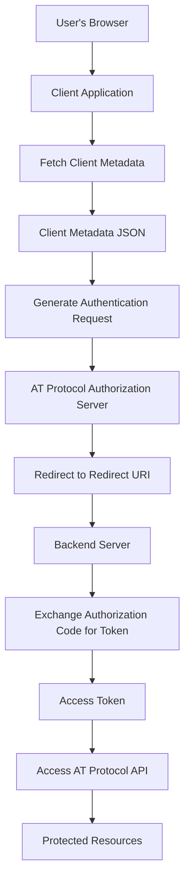

# Bluesky AT Protocol OAuth Flow Documentation

This guide outlines the steps to set up and understand the Bluesky AT Protocol OAuth flow. It covers configuring the OAuth client, initiating the authentication process, handling redirects, and integrating with a backend server for enhanced functionality. 

I'm still working on understanding the full flow and will update this guide as I learn more. Feel free to contribute to this guide if you have any insights to add.

## Table of Contents
- [Bluesky AT Protocol OAuth Flow Documentation](#bluesky-at-protocol-oauth-flow-documentation)
  - [Table of Contents](#table-of-contents)
  - [Introduction](#introduction)
  - [Mermaid Diagram: OAuth Flow](#mermaid-diagram-oauth-flow)
  - [Setting Up the OAuth Client](#setting-up-the-oauth-client)
    - [Creating `client-metadata.json`](#creating-client-metadatajson)
    - [Configuring the OAuth Client in Your Application](#configuring-the-oauth-client-in-your-application)
  - [Understanding Key Configuration Fields](#understanding-key-configuration-fields)
  - [Initiating the Authentication Flow](#initiating-the-authentication-flow)
    - [Triggering the Authentication Flow](#triggering-the-authentication-flow)
    - [Redirecting the User](#redirecting-the-user)
    - [Receiving the Authorization Response](#receiving-the-authorization-response)
    - [Finalizing the Authorization](#finalizing-the-authorization)
  - [Client-Side Implementation Summary](#client-side-implementation-summary)
  - [Integrating with a Backend Server](#integrating-with-a-backend-server)
    - [Backend Server Setup](#backend-server-setup)
    - [Redirect URI Adjustments](#redirect-uri-adjustments)
    - [Authorization Code Exchange](#authorization-code-exchange)
    - [Fetching and Syncing User Data](#fetching-and-syncing-user-data)
    - [Client-Side Integration with Backend](#client-side-integration-with-backend)
  - [Key Considerations](#key-considerations)
    - [Security](#security)
    - [Consistency](#consistency)
    - [Scopes](#scopes)
    - [User Experience](#user-experience)
  - [Summary](#summary)
    - [Quick Steps Recap:](#quick-steps-recap)

## Introduction

The AT Protocol is a decentralized protocol that facilitates OAuth-based authentication without a formal client registration process. Instead of using a registered client ID, you host a `client-metadata.json` file on your server, which serves as the identifier for your OAuth client. This guide will walk you through setting up this configuration and integrating the OAuth flow into your application.

## Mermaid Diagram: OAuth Flow

Below is a visual representation of the OAuth flow using a [Mermaid](https://mermaid.live/) diagram:



## Setting Up the OAuth Client

### Creating `client-metadata.json`

**Create the File:**
1. Name the file `client-metadata.json`.
2. Ensure it's accessible publicly via a URL, such as `https://your-domain.com/oauth/client-metadata.json`.

**Define the Content:**
Include the following JSON structure with the necessary configuration details:

```json
{
  "client_id": "https://your-domain.com/oauth/client-metadata.json",
  "redirect_uris": ["https://your-domain.com/oauth/callback"],
  "scope": "atproto:basic",
  "client_uri": "https://your-domain.com",
  "logo_uri": "https://your-domain.com/logo.png",
  "policy_uri": "https://your-domain.com/privacy-policy",
  "tos_uri": "https://your-domain.com/terms-of-service"
}
```

**Field Descriptions:**
- `client_id`: URL where `client-metadata.json` is hosted.
- `redirect_uris`: Array of URLs where the authorization server can redirect after authentication.
- `scope`: Permissions your application requests (`atproto:basic` for minimal access).
- `client_uri`: URL of your application's homepage.
- `logo_uri`: URL to your application's logo image.
- `policy_uri`: URL to your privacy policy.
- `tos_uri`: URL to your terms of service.

### Configuring the OAuth Client in Your Application

**Install the OAuth Library:**
Ensure you have the `@atcute/oauth-browser-client` library installed in your project.

**Import and Configure:**
Use the `configureOAuth` function to set up your OAuth client with the metadata.

```javascript
import { configureOAuth } from '@atcute/oauth-browser-client';

configureOAuth({
  metadata: {
    client_id: 'https://your-domain.com/oauth/client-metadata.json',
    redirect_uri: 'https://your-domain.com/oauth/callback',
  },
});
```

- `client_id`: Must match the URL of your `client-metadata.json` file.
- `redirect_uri`: Must match one of the URLs specified in `redirect_uris`.

## Understanding Key Configuration Fields

- `client_id`: Acts as the unique identifier for your OAuth client. It's the URL where `client-metadata.json` is hosted.
- `redirect_uris`: Specifies where the authorization server should redirect the user after authentication. Ensure this URL is secure (HTTPS).
- `scope`: Defines the level of access your application is requesting. Use the minimal required scope (`atproto:basic`) to adhere to the principle of least privilege.
- **Additional Fields** (`client_uri`, `logo_uri`, `policy_uri`, `tos_uri`): While optional, these fields enhance the user experience by providing context about your application during the authentication process.

## Initiating the Authentication Flow

### Triggering the Authentication Flow

When a user opts to sign in (e.g., clicks a "Sign in with Bluesky" button), initiate the OAuth flow by generating an authorization URL.

**Import the Function:**
```javascript
import { createAuthorizationUrl } from '@atcute/oauth-browser-client';
```

**Generate the URL:**
```javascript
const authUrl = createAuthorizationUrl({
  // Additional options can be added here
});
```

### Redirecting the User

After generating the authorization URL, redirect the user to it to commence the authentication process.

```javascript
window.location.href = authUrl;
```

This action sends the user to the AT Protocol authorization server, where they will authenticate and grant permissions to your application.

### Receiving the Authorization Response

Post-authentication, the user is redirected back to your specified `redirect_uri` (e.g., `https://your-domain.com/oauth/callback`). Your application should handle the incoming URL parameters to proceed with finalizing the authorization.

### Finalizing the Authorization

Use the `finalizeAuthorization` function to complete the OAuth flow:

**Import the Function:**
```javascript
import { finalizeAuthorization } from '@atcute/oauth-browser-client';
```

**Finalize and Obtain the Session:**
```javascript
const session = await finalizeAuthorization(window.location.href);
```

This function exchanges the authorization code for an access token and returns a session object for authenticated API requests.

## Client-Side Implementation Summary

**Setup:**
- Host `client-metadata.json` on your server.
- Configure OAuth using `configureOAuth`.

**Authentication Flow:**
1. User clicks "Sign in with Bluesky".
2. Generate and redirect to the authorization URL using `createAuthorizationUrl`.
3. Handle the redirect back and finalize authorization with `finalizeAuthorization`.

**Key Points:**
- `client_id` is the URL of your `client-metadata.json`.
- `redirect_uri` must match the one in `client-metadata.json`.
- Use minimal scopes required (`atproto:basic`).

## Integrating with a Backend Server

For enhanced security and data management, integrating OAuth with a backend server is recommended. This setup centralizes token management and user data synchronization.

### Backend Server Setup

- **Host `client-metadata.json`:** Ensure your backend server serves the `client-metadata.json` file at a publicly accessible URL.
- **Handle OAuth Redirects:** The backend will manage redirects and handle token exchanges securely.

### Redirect URI Adjustments

Update the `redirect_uri` in `client-metadata.json` to point to a backend route, e.g., `https://your-domain.com/api/oauth/callback`.

### Authorization Code Exchange

- **Handle Callback:** When the user is redirected to `https://your-domain.com/api/oauth/callback`, extract the authorization code from the URL parameters.
- **Exchange Code for Token:** Use the `finalizeAuthorization` function server-side to exchange the authorization code for an access token.

```javascript
const session = await finalizeAuthorization(callbackUrl);
// Store session.accessToken securely in your database
```

### Fetching and Syncing User Data

- **Access AT Protocol API:** Use the stored access token to make authenticated requests to the AT Protocol API.
- **Download and Parse Data:** Implement logic to download the user's CAR file, parse the data, and store it in your database.
- **Periodic Syncing:** Set up scheduled jobs or triggers to periodically fetch and update user data to keep it current.

### Client-Side Integration with Backend

- **Initiate OAuth Flow:** The client redirects the user to the backend's OAuth initiation endpoint instead of directly to the authorization server.
- **Display User Data:** Fetch and display user data from the backend instead of directly from the AT Protocol API.
- **Secure Communication:** Ensure all client-backend communications are secure (use HTTPS and proper authentication mechanisms).

## Key Considerations

### Security
- Always use HTTPS to protect data in transit.
- Store access tokens securely on the backend, avoiding exposure to the client-side.

### Consistency
- Ensure that `client_id` and `redirect_uri` in your application code match those in `client-metadata.json`.

### Scopes
- Request only the necessary scopes to minimize potential security risks and enhance user trust.

### User Experience
- Provide clear information about your application through `client_uri`, `logo_uri`, `policy_uri`, and `tos_uri` to build user trust during the authentication process.

## Summary

Setting up the Bluesky AT Protocol OAuth flow involves creating a `client-metadata.json` file, configuring your application with the necessary OAuth settings, and handling the authentication process both on the client and optionally on the backend. By following this guide, you can implement a secure and efficient OAuth flow that leverages the decentralized nature of the AT Protocol.

### Quick Steps Recap:
1. **Create and Host `client-metadata.json`:**
   - Define essential OAuth configuration.
   - Host it at a publicly accessible URL.
2. **Configure OAuth in Your Application:**
   - Use `configureOAuth` with your metadata.
3. **Implement Authentication Flow:**
   - Trigger authorization URL creation.
   - Redirect users for authentication.
   - Handle redirects and finalize authorization.
4. **(Optional) Integrate with Backend:**
   - Securely manage tokens and user data.
   - Enhance data synchronization and user experience.

By adhering to these steps and considerations, you can effectively integrate Bluesky's OAuth flow into your application, ensuring secure and seamless user authentication.
